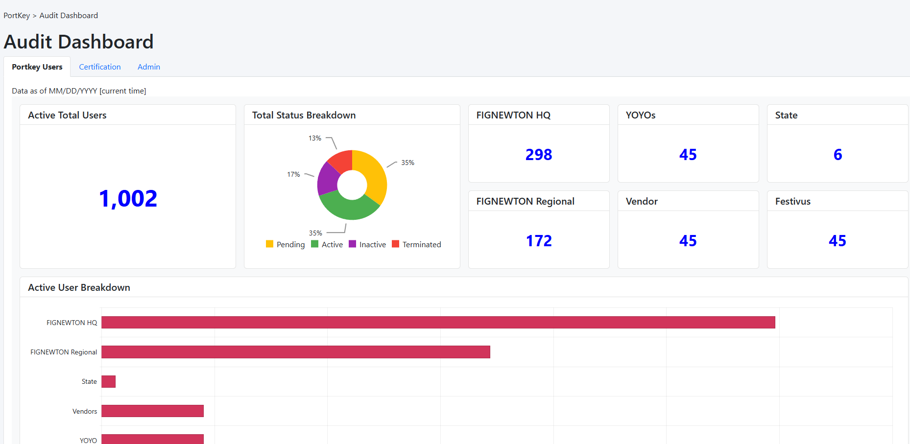

# AuditDashboard



This project was generated with [Angular CLI](https://github.com/angular/angular-cli) version **21.2.2**. It serves as a modern Audit Reporting Dashboard prototype utilizing **Signals**, **rxResource**, and **Kendo UI**.

---

## 🚀 Quick Start

### Prerequisites
* **Node.js**: v18.0 or higher
* **npm**: v9.0 or higher
* **Angular CLI**: `npm install -g @angular/cli`

### Installation & Setup
1. **Initialize Project:**
   ```bash
   ng new audit-dashboard-prototype --routing --style scss --ssr false
   cd audit-dashboard-prototype
   ```
2. **Install Dependencies:**
```bash
  npm install bootstrap @progress/kendo-angular-charts @progress/kendo-angular-layout @progress/kendo-angular-intl @progress/kendo-drawing @progress/kendo-licensing @progress/kendo-theme-bootstrap
```
3. **Run Development Server:**
```bash
  ng serve -o
```
Navigate to http://localhost:4200/. The app reloads automatically on save.

## 🏗 Architecture & Scaffolding

### Feature Structure
Build out the core audit reporting features using the following schematics:

```bash
# 1. Feature Module
ng generate module features/audit-report --routing

# 2. Shell Component
ng generate component features/audit-report --module features/audit-report

# 3. Tab Components
ng generate component features/audit-report/components/Portkey-users --module features/audit-report
ng generate component features/audit-report/components/Certification --module features/audit-report
ng generate component features/audit-report/components/admin --module features/audit-report

# 4. Data Service
ng generate service features/audit-report/services/audit-data
```

### Configuration

#### A. Asset Management
Path: `src/assets/data/`

File: `audit-report.json` (Paste mock data from architecture docs).

#### B. Global Styles (src/styles.scss)

```css
@import "@progress/kendo-theme-bootstrap/dist/all.css";
@import "bootstrap/dist/css/bootstrap-grid.min.css";
@import "bootstrap/dist/css/bootstrap-utilities.min.css";
```

#### C. Build Options (angular.json)
Ensure Bootstrap is included in the styles array:

```json
"styles": [
  "node_modules/bootstrap/dist/css/bootstrap.min.css",
  "src/styles.scss"
]
```

## 🧪 Testing & Building

| Command | Description |
| :--- | :--- |
| `ng build` | Compiles the project into the `dist/` directory with production optimizations. |
| `ng test` | Executes unit tests using the Vitest runner. |
| `ng e2e` | Runs end-to-end tests. |

## 🤖 AI Agent Performance & Cost Control
Guidelines for optimizing Gemini/MCP interactions.

### 1. Tool Design
**Summarize Over Bulk:** Tools should return filenames and metadata by default. Read full file content only upon explicit request.

**Offload Logic to Python:** Use Python (e.g., SymPy) for complex math, regex, or file parsing. Let the LLM handle reasoning, not raw computation.

### 2. Prompt Engineering
**Avoid Global Requests:** Instead of "Audit all," use "List all, then I will select which to audit."

**State Awareness:** Instruct the agent to refer to the last 3 entries of `developer_log.md` to minimize context window bloat.

**Clear Termination:** End prompts with "Only output JSON" or "Provide a concise summary" to prevent token-heavy rambling.

### 3. Cache Management
**Batch Workflows:** Perform multiple related tasks in one session to maximize the Savings Highlight (Cache hits).

**Stable Blueprints:** Batch updates to `GEMINI.md`. Frequent, minor changes can invalidate the cached context block.

## 🛠 Troubleshooting
**Kendo Watermark:** Expected during prototyping without a license key. Functionality is unaffected.

**Module Errors:** Verify `ChartsModule` and `LayoutModule` are imported in `features/audit-report/audit-report.module.ts`.